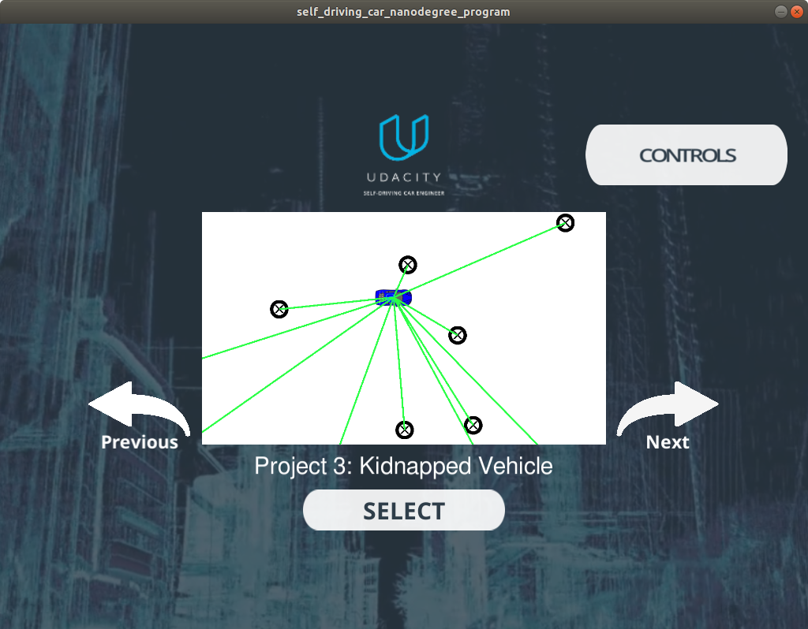
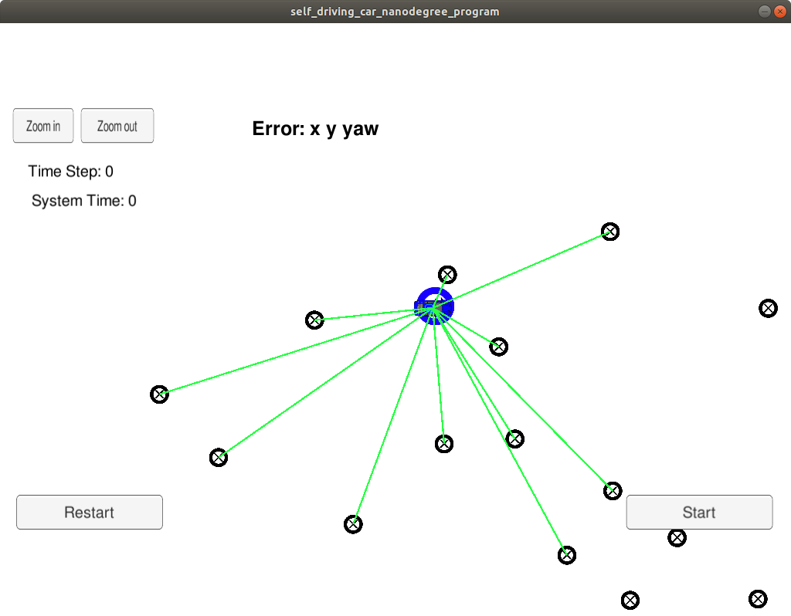

# Kidnapped Vehicle based on Particle Filter

* Udacity's Self-Driving Car Engineer Nanodegree Project 3: Kidnapped Vehicle

---

## Install & Build

```sh
sudo apt-get install libuv1-dev libssl-dev

# for Udacity's Self-Driving Car Simulator
git clone https://github.com/uWebSockets/uWebSockets 
cd uWebSockets
git checkout e94b6e1
mkdir build
cd build
cmake ..
make 
sudo make install
cd ..
cd ..
sudo ln -s /usr/lib64/libuWS.so /usr/lib/libuWS.so

# Download the Simulator
# ref: https://blog.csdn.net/u013468614/article/details/103608103
wget https://github.com/udacity/self-driving-car-sim/releases/download/v1.45/term2_sim_linux.zip
unzip term2_sim_linux.zip
cd term2_sim_linux
chmod +x term2_sim.x86_64

# the project
mkdir build
cd build
cmake ..
make -j `nproc`
```

## Run

* run **Udacity's Self-Driving Car Simulator**

  ```sh
  ./term2_sim.x86_64
  ```

  <p>
    
    
  </p>

* run the project
  ```sh
  # Run particle filter
  cd ./build
  ./particle_filter
  ```
* output
  ```
  Listening to port 4567
  Connected!!!
  highest w 7.14739e-05
  average w 5.1851e-05
  highest w 0.0165681
  average w 0.0104537
  highest w 0.00650401
  average w 0.00380714
  highest w 0.000215487
  average w 0.000110921
  ```

* communicate with simulator
  - receive
    ```json
    [
      "telemetry",
      {
        "sense_x":"190.1224",
        "sense_y":"24.2010",
        "sense_theta":"0.0756",
        "previous_velocity":"11.1880",
        "previous_yawrate":"-0.0122",
        "sense_observations_x":"-12.7605 15.9672 4.8438 -18.3355 22.9478 -40.5985 42.4341 -20.6061 ",
        "sense_observations_y":"4.4701 3.7626 -15.8923 5.8343 -33.4763 -12.9406 4.7422 -38.6080 "
      }
    ]
    ```
  - transmit
    ```json
    42
    [
      "best_particle",
      {
        "best_particle_associations":"",
        "best_particle_sense_x":"",
        "best_particle_sense_y":"",
        "best_particle_theta":0.0658322354423997,
        "best_particle_x":190.052455793541,
        "best_particle_y":24.398365293091
      }
    ]
    ```

## Others

This is the particle filter project. If you want to know the localisation from scratch please visit my article in medium.

```
function(tol=0.2) {
    p = [0, 0, 0]
    dp = [1, 1, 1]
    best_error = move_robot()
    loop untill sum(dp) > tol
        loop until the length of p using i
            p[i] += dp[i]
            error = move_robot()

            if err < best_err
                best_err = err
                dp[i] *= 1.1
            else
                p[i] -= 2 * dp[i]
                error = move_robot()

                if err < best_err
                    best_err = err
                    dp[i] *= 1.1
                else
                    p[i] += dp[i]
                    dp[i] *= 0.9
    return p
}
```
